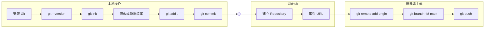

[回到Readme](/Readme.md)



# 初始化跟第一次上傳

## Git 倉庫初始化 & 第一次提交

Windows

- 在 https://git-scm.com 下載並且安裝

or

Macs

- Homebrew:

```bash
brew install git
```

or

- MacPorts:

```bash
sudo port install git
```

## 檢查是否安裝 & 檢查安裝版本

```bash
git --version
```

## 本地資料夾初始化

```bash
git init
```

## 建立新資料

進行上傳前需要專案有變化(建立新檔案、修改檔案)

在資料夾內新增一個 README.md

觀察在建立完之後檔案名有沒有顏色變化

新建立的會是藍色(Untracked)

修改過的是橘色(Modified)

## 建立遠端Github 倉庫

登入Github

點選畫面左邊綠色的New

幫新倉庫取名字(取名很重要，要想一下)
可以用的名字會在下方綠色提醒(123 is available.)

其他不用動按建立倉庫

## 連接遠端Github倉庫

建立好倉庫會在倉庫主頁看到這塊藍色的區域
將右邊HTTPS的部分複製起來

將下面的 [空格後貼連結] 替換成剛剛複製的倉庫連結

git remote add origin [空格後貼連結]

```bash
git remote add origin
```

## 加入所有變更 ##

```bash
git add .
```

## 提交變更至本地版本庫

實作專案的時候請把 "" 改成這次的更新做了什麼

```bash
git commit -m "Connect project to remote Git repository."
```

## 把目前所在的分支（通常是 master）改名為 main

```bash
git branch -M main
```

## 初次推送並設定 Upstream

```bash
git push -u origin main
```

這樣就完成第一次，也是最複雜的一次操作了

[回到Readme](/Readme.md)