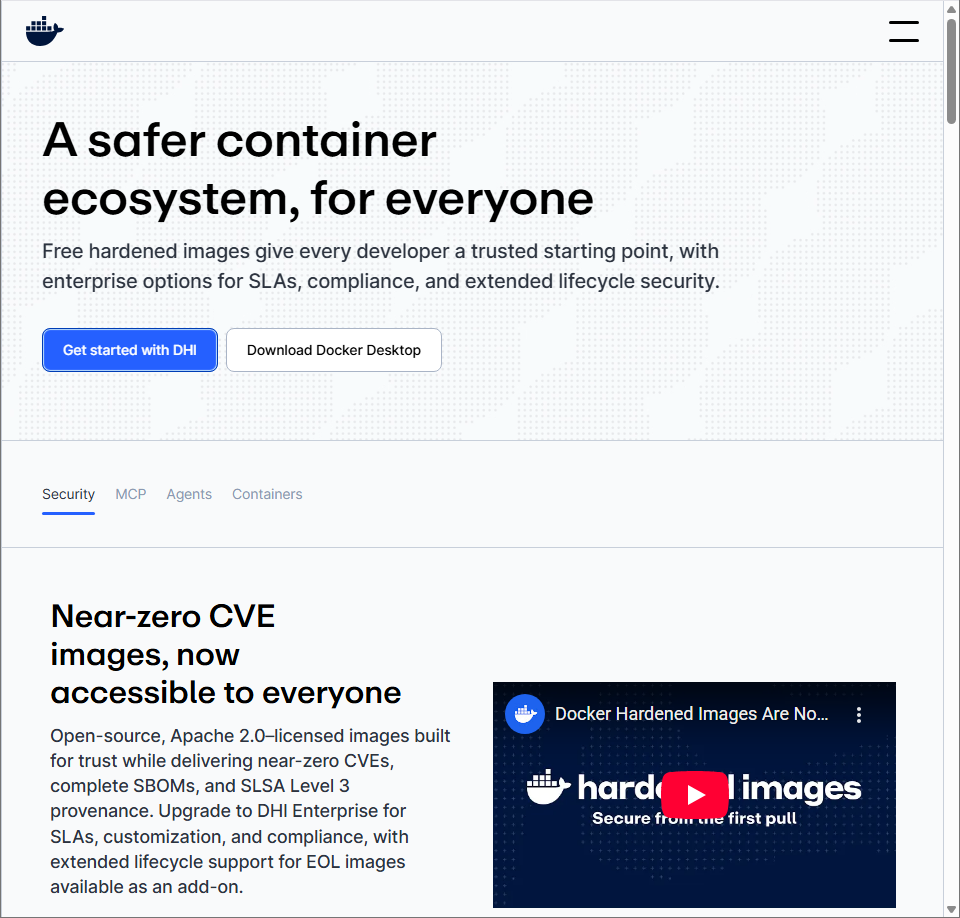
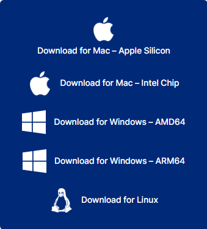
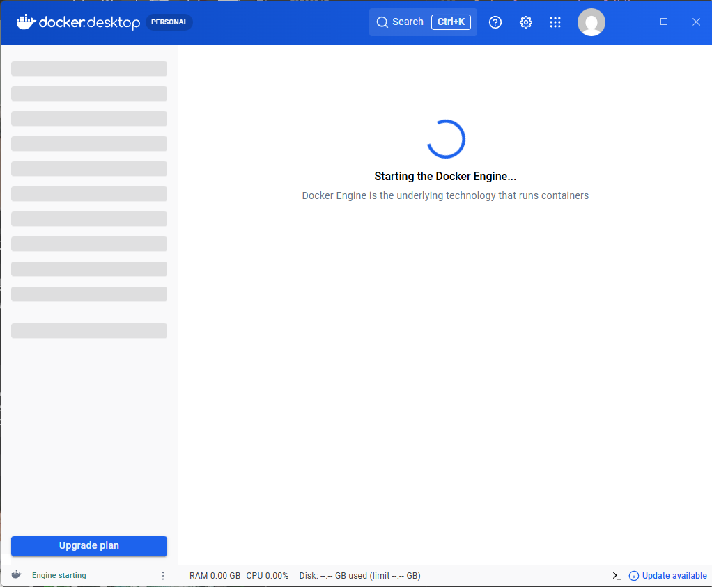
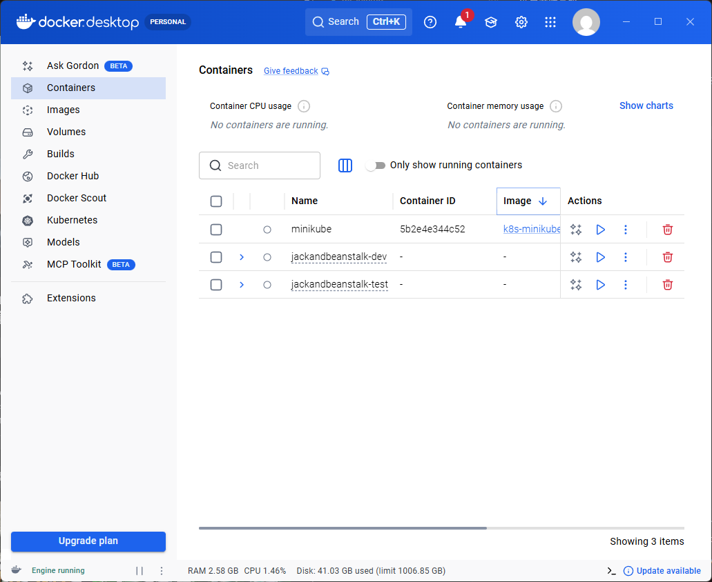

[回到Readme](/Readme.md)

# Docker

在學習程式開發的過程中

環境配置（Environment Setup）往往是初學者最容易遇到問題的地方

許多人可能都有過這樣的經驗：同一份程式碼，在自己的電腦可以正常執行，但換到同學的電腦、助教的電腦，甚至部署到伺服器上時卻突然出現錯誤

這通常不是程式本身的問題

而是因為每台電腦的開發環境不同

例如：作業系統、套件版本、依賴程式或系統設定不一致所造成

如果用一個生活中的比喻來理解這個問題

可以把「開發環境」想像成一間房子

傳統的開發方式就像是：

每當你搬到一個新的地方

就必須重新裝潢整個房子

你需要重新鋪地板、重新裝家具、重新接電線

甚至還可能因為材料或施工方式不同而導致結果不一樣

這不僅耗時

也容易出現各種問題

而 Docker (容器技術，Container Technology) 的概念則更像是一台房車 (RV, Recreational Vehicle)

房車裡面已經包含了所有需要的設備：床、廚房、水電系統、儲物空間等等

當你需要移動到不同的地方時

你不需要重新裝潢房子

只要把整台房車開到新的地點

就可以立刻開始生活

在軟體開發中

Docker 也是同樣的概念

它可以把程式執行所需要的程式碼、依賴套件、執行環境與設定全部打包在一個 容器（Container） 裡

無論是在自己的電腦、同學的電腦

或是雲端伺服器上

只要有 Docker

就可以用同樣的方式執行這個容器

因此，Docker 帶來了幾個重要的好處：
- 環境一致性（Environment Consistency）
不再出現「只有在我電腦可以跑」的問題
- 快速部署（Fast Deployment）
可以在幾秒內啟動一個完整的應用環境
- 容易分享（Portability）
整個系統可以像搬運房車一樣移動到任何支援 Docker 的地方
- 環境隔離（Isolation）
不同專案可以使用不同版本的套件，而不會互相干擾

在接下來的課程中

我們將透過 Docker 來建立開發環境

讓專案能夠在不同電腦之間保持一致

並學習現代軟體開發中常見的容器化（Containerization）流程

接下來這堂課會教你們如何使用 Docker 將程式容器化節省你在開發時布置環境的時間

第一步我們當然要先安裝 Docker 才可以使用

進入下面的網址下載 docker 

https://www.docker.com



進入之後點擊 Download Docker Desktop 的按鈕


之後選擇符合你現在裝置的版本



在下載的途中我們檢查一下房車的輪子有沒有安裝好

Docker 容器本質上是一個 Linux 環境

但很多同學的電腦是 Windows

因此 Windows 需要一個能執行 Linux 的系統層

WSL2 就是這個角色

它讓 Windows 可以直接執行 Linux

Docker 也因此可以在 Windows 上運作

第一步我們需要打開工作管理員

檢查在效能頁面下

CPU 的監控頁面右下方是否有 模擬:已啟用

如果是未啟用

我們再重新啟動的時候

在黑畫面時點擊鍵盤上 DEL 鍵來進入 BIOS (不同廠牌的主機板可能會導致按鍵不同)

BIOS（Basic Input/Output System）是電腦主機板上的一個基本韌體（Firmware）

負責在電腦開機時初始化硬體設備

例如 CPU、記憶體和硬碟

當電腦開機時

BIOS 會先檢查硬體是否正常

然後再把控制權交給作業系統（例如 Windows 或 Linux）

使用者也可以進入 BIOS 設定系統底層功能

例如:開啟 CPU 虛擬化（Virtualization）、設定開機順序或調整硬體設定

檢查好 CPU 虛擬化

我們就需要先安裝 wsl

在 windows 上想要使用 Docker 時

Docker 會依賴 WSL2 (Windows Subsystem for Linux 2) 來提供 Linux 執行環境

因此，如果電腦沒有安裝 WSL2

Docker 將無法正常運作

在安裝之前先檢查一下裝置是否已經安裝過了

```bash
wsl --version
```

如果沒有看到回復版本或者是看到回報錯誤

就需要進行安裝

現在我們需要打開 windows search

輸入 powershell (比 cmd 新的 windows 終端)

看到 powershell 之後對著這個應用程式點右鍵叫出選單

點下一個叫做 以系統管理員執行 的選項

進入之後應該會發現介面有些許的不一樣

我們輸入下面的指令來安裝 wsl

```bash
wsl --install
```

這個指令會自動：
- 啟用 WSL 功能
- 安裝 WSL2
- 安裝 Ubuntu Linux
- 設定 Linux Kernel

安裝完成後需要 重新開機

重新開機完之後我們再一次檢查一下有沒有安裝成功


```bash
wsl --version
```

如果回答中有版本號碼就是成功安裝好了

接著查看目前的 Linux 發行版

```bash
wsl -l -v
```

可能會看到

```bash
NAME      STATE           VERSION
Ubuntu    Running         2
```

重要的是 VERSION 必須是 2

如果版本不是 WSL2

可以升級成 WSL2

```bash
wsl --set-version Ubuntu 2
```

設定預設使用 WSL2

```bash
wsl --set-default-version 2
```

這時我們開啟剛剛安裝 Docker 安裝包的資料夾

依照安裝器的指示逐步安裝好 Docker

接下來檢查一下 Docker 是否有安裝成功

```bash
docker --version
```

如果安裝成功，會看到類似：

```bash
Docker version 29.X.X, build aXcXX9X
```

再檢查 Docker Compose：

```bash
docker compose version
```

如果安裝成功應該會看到類似：

```bash
Docker Compose version v5.X.X
```

就算安裝完成

如果 Docker Desktop 沒有打開

也會無法使用

請在桌面或者搜尋找到 Docker Desktop 並打開



等待應用程式準備好



看到左下角有 Engine running 就是 Docker 正在正常運作了


除了開啟應用程式

我們還可以藉由指令來檢查 Docker 是不是有正常在運作

```bash
docker ps
```

正常應該會看到類似：

```bash
CONTAINER ID   IMAGE   COMMAND   CREATED   STATUS   PORTS   NAMES
```

即使現在沒有容器在執行

只要沒有報錯

就代表 Docker Engine 正常

如果出現類似這種訊息：

```bash
Cannot connect to the Docker daemon
```

代表 Docker Desktop 還沒開

請先啟動 Docker Desktop

當我們準備好房車的拖車部分

現在我們就可以開始蓋房子了

這邊的房子我們要蓋的是 Flask

在其他情況下房子可以是別的應用程式

可以是資料庫、AI助手、AI代理人等等

也可以在一個車頭掛好幾個拖車來建立一個很大的應用程式群組

反正只要我們處理好了 Docker 這個工具

我們想在上面蓋什麼都可以自由發揮

在此同時也可以省下大把時間

在蓋房子之前我們先來討論一下藍圖

Flask 是一個使用 Python 開發的輕量級 Web 框架

用來建立網站和 API

它設計簡單、彈性高

開發者可以自由選擇需要的工具與套件來擴充功能

常見 Python Web 框架有
- Flask (微量級)
- Tornado (輕量級)
- FastAPI (中量級)
- Django (重量級)

他們分別是微、輕、中、重量級框架

Flask 常被用來快速開發 Web 應用、RESTful API 或作為後端服務

在建立 Python 程式的時候通常會需要三個組件
- Flask 程式
- requirements.txt
- Dockerfile

Flask 程式就像是房車裡面實際的生活空間

例如：
- 床
- 廚房
- 桌子等

這些東西代表我們真正想使用的功能

也就是網站的邏輯與服務內容

沒有 Flask 程式

就像房車裡什麼都沒有

即使車子可以開

也沒有實際用途

requirements.txt 就像是一張設備清單

告訴我們這台房車裡需要安裝哪些設備

例如：
- 瓦斯爐
- 冰箱
- 水槽

在 Python 專案中

這些設備就是 套件（packages）

例如：
- Flask
- requests
- numpy

當 Docker 建立環境時

就會依照這份清單把所有需要的套件安裝好

Dockerfile 就像是房車的 建造說明書（construction manual）

它會一步一步描述如何打造這台房車

例如：
- 使用哪一種車體（基礎系統，例如 Python image）要把哪些設備清單放進去（requirements.txt）
- 要怎麼安裝設備（pip install）
- 最後車子啟動時要做什麼事情（啟動 Flask）

Docker 會依照 Dockerfile 的指示

建造出一個完整的 Image（房車本體）

然而一個比較大的專案通常不會只有一個容器

這時候我們就需要 .yml (YAML) 房車停車場與車隊管理圖

.yml 檔案通常用來描述多個容器如何一起運作

最常見的是 docker-compose.yml

這張配置圖會說明
- 哪幾台房車要一起停在營地
- 哪一台負責廚房（例如 backend）
- 哪一台負責客廳（frontend）
- 哪一台是倉庫（database）
- 他們之間怎麼互相連接

例如一個網站可能會有：
- 前端（frontend container）
- 後端（backend container）
- 資料庫（database container）

.yml 就負責把這些服務一起啟動與管理

總而言之Flask 程式是房車裡真正提供服務的空間

requirements.txt 是需要安裝的設備清單

Dockerfile 是建造房車的說明書

而 .yml 則是管理多台房車如何一起運作的營地配置圖

了解完我們等一下要蓋的東西之後現在就可以開始動工了

第一步先建立一個專案資料夾(flask-docker)

這個資料夾之後會放：
- Flask 程式
- requirements.txt
- Dockerfile

進行第一次的 Git init 跟 push

現在建立最小 Flask App

建立一個檔案，命名為 app.py

內容如下：

```bash
from flask import Flask

app = Flask(__name__)

@app.route("/")
def home():
    return "Hello, Docker Flask!"

if __name__ == "__main__":
    app.run(host="0.0.0.0", port=5000)
```

建立 requirements.txt

在資料夾建立 requirements.txt

內容如下：

```bash
flask
```

這個檔案的用途是告訴 Docker

這個 Flask 專案需要安裝哪些 Python 套件

再來建立一個檔案

名稱一定要叫 Dockerfile

內容如下：

```bash
# 以 Python 3.11 的輕量版映像檔作為基底
FROM python:3.11-slim

# 把容器內的工作目錄設成 /app
# 後面的操作都會在這個資料夾進行
WORKDIR /app

# 把本機的 requirements.txt 複製到容器裡
COPY requirements.txt .

# 在容器中安裝 Flask
RUN pip install --no-cache-dir -r requirements.txt

# 把目前專案資料夾裡的內容全部複製進容器
COPY . .

# 容器啟動後，自動執行 python app.py
CMD ["python", "app.py"]
```

建立好三件套之後

在專案目錄下輸入

```bash
docker build -t flask .
```

建立後輸入以下指令檢查一下是否檢查成功

```bash
docker images
```

應該會看到 flask 出現在列表中

建立好之後就是啟動了

```bash
docker run -d -p 5000:5000 --name flask-container flask
```

在終端機返回可以按任意鍵退出的時候

我們回到 Docker Desktop

在 Container 也就是容器頁面

應該要能看到有一個 Flask-container 在運作

接下來我們要進我們蓋好的房子裡面看看了

打開瀏覽器輸入

```bash
http://localhost:5000
```

如果成功就會看到

```bash
Hello, Docker Flask!
```