[回到Readme](/Readme.md)




```mermaid
flowchart LR

subgraph BASIC["Flask 基礎"]
    A[單一路由回傳文字]
    B[改為回傳 HTML]
    C[理解 HTML 結構]
end

subgraph TEMPLATE["模板化"]
    D[使用 render_template]
    E[建立 templates 資料夾]
    F[建立 index.html]
end

subgraph ROUTES["多路由"]
    G[新增路由]
    H[建立多個 HTML 頁面]
    I[透過網址切換頁面]
end

subgraph STATIC["靜態資源"]
    J[建立 static 資料夾]
    K[分離 CSS]
    L[透過 url_for 引入 CSS]
end

subgraph JINJA["Jinja 動態模板"]
    M[傳入變數]
    N[條件判斷]
    O[迴圈顯示資料]
end

subgraph NAVBAR["導覽列"]
    P[使用超連結]
    Q[url_for 路由跳轉]
end

subgraph LAYOUT["版型繼承"]
    R[建立 base.html]
    S[使用 extends]
    T[使用 block content]
end

subgraph RESULT["最終效果"]
    U[多頁面網站]
    V[共用導覽列]
    W[動態內容]
end

A --> B --> C
C --> D --> E --> F
F --> G --> H --> I
I --> J --> K --> L
L --> M --> N --> O
O --> P --> Q
Q --> R --> S --> T
T --> U --> V --> W
```

上一次我們把最小可以用的 Flask 上傳到 Render 裡面了

現在的結構應該長這樣

```bash
from flask import Flask

app = Flask(__name__)

@app.route("/")
def home():
    return "Hello, Docker Flask!"

if __name__ == "__main__":
    app.run(host="0.0.0.0", port=5000)
```

可以看到我們現在的主路由 "/" 只會回傳一句 "Hello, Docker Flask!"

這樣是沒有辦法做標題、段落、按鈕、圖片、導覽列

這時候我們就需要 HTML

HTML 解決的是畫面結構（Structure）的問題

把文字上標籤

讓瀏覽器知道要怎麼顯示他們

現在我們來試試看怎麼把文字上標籤

把

```bash
return "Hello, Docker Flask!"
```

改成

```bash
return "<html>
            <head>
                <title>首頁</title>
            </head>
            <body>
                <h1>歡迎來到我的網站</h1>
                <p>這是用 Flask 直接回傳 HTML</p>

                <a href="/about">前往 About</a>
            </body>
        </html>"
```

現在在 app.run 裡面加入 debug=True

這樣才可以熱重啟

也就是我們存檔後就可以讓新的東西更新在畫面上

這個功能非常重要

可以為我們的開發減去很多不必要的時間花費

存檔後把容器重新建立一次

應該會看到標題的字（歡迎來到我的網站）比下面的端落（這是用 Flask 直接回傳）還來的大

就是因為

```bash
<h1>
```

跟

```bash
<a>
```

是不一樣的標籤

所以會導致每個字或段落可能會跟其他地方不一樣

可是這樣直接在 Flask 寫 HTML 會很麻煩

現在一個網頁隨隨便便就上百上千行文字

我們不可能把它全部塞在 app.py 這樣不僅管理麻煩

有時候格式段落也怪怪的

人眼要看這麼雜的東西是很費力的

雜亂的東西也會影響心情

我們就需要把 HTML 抽取出去

那該怎麼抽呢

這就要靠 render_template 這個 Flask 的原生套件了

它依靠 Jinja2 template engine 運作的

可以幫我們把一些動態的資料加進 HTML 再傳給使用者

也可以讓我們把 HTML 抽離出去

把

```bash
from flask import Flask
```

改成

```bash
from flask import Flask, render_template
```

把新的套件引用進來我們才可以在程式裡面做使用

引用好後把根路由那一大串很雜的 HTML 改成

```bash
return render_template("index.html")
```

然後在根目錄建立一個叫 templates 的資料夾

資料夾裡面再建立一個 index.html

index.html 裡面貼上

```bash
<!DOCTYPE html>
    <html lang="en">
        <head>
            <meta charset="UTF-8" />
            <meta name="viewport" content="width=device-width, initial-scale=1.0" />
            <title>Flask MVP</title>
        </head>
        <body>
            <h1>Flask MVP Website</h1>
            <p>這是一個最小可行版本的 Flask 網站。</p>
        </body>
    </html>
```

存檔後重新整理一下你的網站頁面

應該就會看到大大的 Flask MVP Website 跟其他的內容

現在我們已經幫主頁開好一個模板了

一般來說正常的網頁不會只有一個頁面

拿我們輔仁大學的校網來說

光是導覽行就有八個不同的頁面

所以現在我們來建立一個新的頁面跟他的路由

在主程式的根目錄下面新增一個新的路由

```bash
@app.route("/html_tags")
def html_tags():
    return render_template("html_tags.html")
```

在 templates 裡面新增一個 html_tags.html

之後把 [https://zero1-a6o5.onrender.com/html_tags](https://zero1-a6o5.onrender.com/html_tags) 裡面的 html 抄下來

一樣存檔後刷新你的瀏覽器就可以看到你剛剛抄的內容了

嗎?

沒有對吧

你沒有看到剛剛抄的內容是因為

路由是不一樣的

剛剛建立的是 /html_tags 路由

抬頭看看瀏覽器網址的地方

你會發現自己應該在根路由 /

現在把瀏覽器上面的連結的尾部加上 /html_tags

應該就可以看到剛剛抄的內容了

可以在這個頁面裡面看到大部分的 HTML 標籤可以做到什麼事情

當然

這個頁面是美化過的

純粹的 html 是無法非常方便的做到這種程度的美化的

所以我們需要 CSS 來幫我們做到美化的功能

看到剛剛抄下來的 HTML

會看到有一個叫做 style 的標籤

裡面是用來放 CSS 的

如果你觀察我的網頁主頁的 HTML

你會發現裡面的最後還多了一個標籤 scripts

這是 JavaScripts

是網頁中負責「互動」的部分

它是一種程式語言

也是唯一能讓網頁 活起來 的關鍵

網頁三巨頭

- HTML 標記語言（Markup）
- CSS 樣式語言（Style）
- JavaScripts 程式語言（Programming）

這三部分通常會把它分出來

讓專案達到模組化

比較好管理

如果要重複使用也會更方便

例如我有兩個不同的 HTML

但是想要用同一個背景

就可以在裡面引入相同的 CSS

回到剛剛抄下來的 HTML

看到裡面第一個單元是

```bash
body {
      font-family: Arial, sans-serif;
      line-height: 1.7;
      margin: 0;
      padding: 0;
      background-color: #f7f7f7;
      color: #222;
      }
```

前面的 body 是拿來選中所有 body 標籤的

注意是 所有

如果要指定美化單一一個標籤的話可以使用 class 或 id

一般來說 class 用的比較多

因為 id 是用來指定「單一且唯一」的標籤

現在我們來試試看把 CSS 從 HTML 中分開

在根目錄建立一個 static 資料夾

資料夾裡建立 index.css 檔案

把 style 標籤裡面的所有東西都剪下搬過去 index.html 但是不包含 style 標籤

之後在剛剛的 HTML 裡面找到 head 頭部標籤

在裡面把我們分離好的 CSS 引入回去

```bash
<link rel="stylesheet" href="{{ url_for('static', filename='index.css') }}">
```

注意

這裡的 {{ url_for('static', filename='style.css') }} 是 Flask 裡面的 Jinja 要用的

在其他的框架下可能會不同

有可能是相對路徑或者是絕對路徑

像是

```bash
<link rel="stylesheet" href="/static/index.css">
```

這種寫法在 Flask 也可以但是不建議

因為但是因為 Flask 會幫你

- 處理路徑
- 部署到不同環境不會壞掉
- 支援版本控制（cache busting）

所以還是建議用 Jinja 的寫法

分離好一樣存檔後重新整理

應該可以看到 HTML 裡面沒有 style 標籤

但是網頁的風格應該會跟剛剛有 style 標籤的時候一樣

學會了靜態網頁的基本知識之後

我們就要為我們多路由想辦法了

畢竟每次切換頁面都要打上新的路由絕對不是好點子

現在我們就要學 Jinja 了

Jinja 是一個模板引擎

讓 HTML 可以寫變數與邏輯

並由後端動態產生網頁

跟 JavaScripts 很像但是 Jinja 是內建在 Flask 裡面的

它的工作就是把 Python 資料「填進」HTML

它的工作就是把 Python 資料「填進」HTML

讓原本固定不變的 HTML

變成可以根據資料改變的動態頁面

例如

原本 HTML 只能寫死

```bash
<h1>Hello, Jerry</h1>
```

但使用 Jinja 之後

我們可以在主頁加上

```bash
<h1>Hello, {{ name }}</h1>
```

然後在 Flask 後端傳入資料

修改一下主路由

```bash
@app.route("/")
def home():
    return render_template("index.html", name="Jerry")
```

這樣網頁顯示時，{{ name }} 就會被替換成 Jerry

也就是說

```bash
Python 資料
   ↓
Jinja 模板
   ↓
HTML 頁面
   ↓
瀏覽器顯示
```

Jinja 最常見的用途有三個

第一個是顯示變數

例如使用者名稱、文章標題、商品價格

```bash
<p>使用者名稱：{{ username }}</p>
<p>文章標題：{{ item }}</p>
<p>商品價格：{{ cost }}</p>
```

第二個是使用條件判斷

根據不同情況顯示不同內容

```bash

    <p>歡迎回來</p>

    <p>請先登入</p>

```

第三個是使用迴圈

把一整串資料顯示在畫面上

```bash
    <ul>
        
            <li>{{ item }}</li>
        
    </ul>
```

所以我們可以把 Jinja 理解成

讓 HTML 不只是固定文字

而是可以接收後端資料、產生不同畫面的工具

不過要注意

Jinja 和 JavaScript 不一樣

Jinja 是在「伺服器端」先把 HTML 產生好

也就是渲染伺服器端渲染（Server-Side Rendering, SSR）

再送給瀏覽器

使用者 → Flask → Jinja 產生 HTML → 瀏覽器顯示

JavaScript 則是在「瀏覽器端」執行

用來處理使用者互動

（像 React、Vue、Angular）多半是「用戶端渲染（Client-Side Rendering, CSR）

HTML 一開始幾乎是空的東西送到用戶手上才由 JavaScript 負責產生畫面

使用者 → 拿到空 HTML → JavaScript → 動態生成畫面

就不跟大家細聊語法這些的

我們現在直接用 Jinjia 來幫我們做分頁跳轉的導覽行跟頁尾

剛剛我們建立了多個路由

也試過用改變連結的方式切換到其他路由

現在我們可以利用 HTML 建立超連結字串

在主頁 HTML 的  前段加上

```bash
    <nav>
        <a href="{{ url_for('index') }}">首頁</a>
        <a href="{{ url_for('about') }}">關於我們</a>
        <a href="{{ url_for('html_tags') }}">HTML 展示</a>
    </nav>
```

這樣應該可以透過點擊連結進到我們剛剛建立的兩個新路由頁面

但是你會發現跳轉用的導覽行沒有跟著過來

也就是你每次都要自己貼一次

那如果今天老闆叫我們做店商平台

面對成千上萬個產品頁面

就算我們加班把 Ctrl C Ctrl V 按冒煙也改不完

所以我們要把頁面拆成三個部分

頭部導覽行、中段頁面資料跟尾段頁尾

我們要利用 Jinja 把前段後端固定

以後修改一次前段或後段的修改就完成任務了

所以我們新增一個 base.html

```bash
    <nav>
        <a href="{{ url_for('home') }}">首頁</a>
        <a href="{{ url_for('about') }}">About</a>
        <a href="{{ url_for('contact') }}">Contact</a>
    </nav>

    <hr>

    
```

修改一下所有的 HTML 頁面

格式如下

```bash
    

    
    !原本的內容 自行修改!
    
```

修改完後記得全選後儲存

之後打開網頁熱重啟應該就更新好了

點看看導覽行的超連結

應該會看到導覽行跟過來了

至此

我們完成了

網站多路由、多頁面跟動態的導覽行

[回到Readme](/Readme.md)