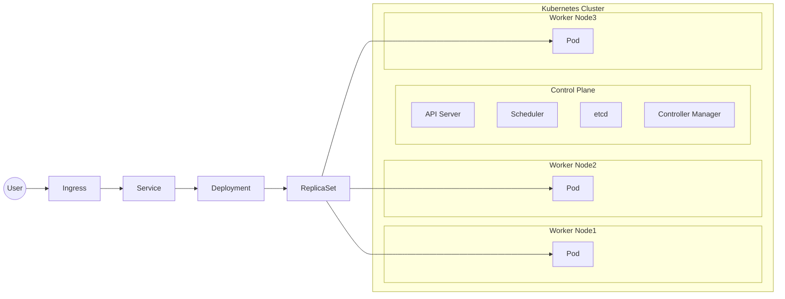

[回到Readme](/Readme.md)

# 認識 Kubernetes

Kubernetes（常簡寫為 K8s）是現代雲端與容器化架構的核心之一

Kubernetes（K8s） 是一個由 Google 最初開發

現由 Cloud Native Computing Foundation (CNCF) 維護的開源容器編排系統（Container Orchestration System）

簡單說 Docker 解決的是「怎麼打包應用程式」

Kubernetes 解決的是「怎麼在多台機器上自動管理、部署與擴展這些容器」

| 功能/特點 | 說明 |
| :--- | :--- |
| 🧱 容器編排 (Container Orchestration) | 自動在多台主機（節點）上部署、調度與管理容器 |
| 📦 自動化部署與回滾 (Deployment & Rollback) | 當你更新版本時，K8s 會逐步替換容器，出錯時可自動回滾到舊版本 |
| ⚖️ 自動負載平衡 (Load Balancing) | 自動分配流量給多個副本容器，確保系統穩定 |
| 🔁 自我修復 (Self-healing) | 當容器崩潰、節點失聯時，K8s 會自動重啟或替換 |
| 📈 自動水平擴展 (Auto Scaling) | 根據 CPU、記憶體或自訂指標，自動增加或減少容器數量 |
| 🔒 設定與秘密管理 (Config & Secrets Management) | 將環境變數、密鑰等安全地與容器分離管理 |
| 🌐 服務發現與網路 (Service Discovery & Networking) | 提供內建的 DNS 與 IP 管理，讓容器彼此能透過固定服務名互相連線 |
| 🗂️ 儲存管理 (Storage Orchestration) | 支援自動掛載本地磁碟、雲端儲存（AWS EBS、GCP PD、NFS 等）|
| 🧩 模組化架構 (Modular Architecture) | 可與 CI/CD、監控、Ingress、Service Mesh（如 Istio）整合 |
| ☁️ 跨雲與混合部署 (Multi-cloud & Hybrid) | 可同時管理多個雲供應商或自架機房的容器叢集 |

Kubernetes 的核心組件

| 組件 | 角色 | 說明 |
| :--- | :--- | :--- |
| Pod | 最小部署單位 | 一個或多個容器的集合，分享同個網路與儲存空間 |
| Node | 節點（主機） | 實際運行 Pod 的實體或虛擬機器 |
| Cluster | 叢集 | 一組 Node 組成的整體 |
| Deployment | 控制器 | 管理 Pod 副本數、滾動更新與回滾 |
| Service | 網路抽象層 | 為 Pod 提供固定 IP / DNS 名稱，負責負載平衡 |
| Ingress | 外部入口 | 控制 HTTP/HTTPS 流量進入叢集的方式 |
| ConfigMap / Secret | 設定與憑證 | 外部化環境變數與敏感資料 |
| Namespace | 命名空間 | 用來隔離不同專案或環境（dev/prod） |
| Scheduler / Controller Manager / API Server / etcd | 控制平面 (Control Plane) | 負責叢集整體的狀態、決策與儲存 |

Kubernetes 的優勢

| 優勢 | 說明 |
| :--- | :--- |
| ✅ 高可用性 (High Availability) | 自動修復、負載平衡確保不中斷服務 |
| ⚙️ 彈性擴展 (Scalability) | 自動擴容與縮容，支援高流量突增 |
| 🧳 可攜性 (Portability) | 在任何雲端或地端環境運行相同容器 |
| 🧩 模組化與擴展性 | 可整合 Helm、Prometheus、Istio、ArgoCD 等工具 |
| 💰 成本效益 | 自動釋放資源、動態分配，節省運算成本 |

Kubernetes 的典型應用場景
- 微服務架構 (Microservices Architecture)
- 讓上百個服務能獨立部署與管理
- 雲原生應用 (Cloud-native Apps)
- 天然適合多雲與 CI/CD 自動化環境
- 大數據 / AI / ML 工作負載
- 可透過 GPU 節點與 Job 管理分佈式訓練
- 自動化 DevOps Pipeline
- 結合 GitHub Actions、Jenkins、ArgoCD 等工具
- 多人共用的測試環境
- 利用 Namespace 隔離不同專案

與 Docker 的關係（常被搞混）

| 比較項目 | Docker | Kubernetes |
| :--- | :--- | :--- |
| 主要用途 | 容器打包與運行 | 容器的自動部署、管理與擴展 |
| 控制範圍 | 單一主機 | 多主機叢集 |
| 部署單位 | 容器 (Container) | Pod（可含多容器） |
| 自動化能力 | 有限 (Docker Compose) | 完整（自我修復、滾動更新、負載平衡等） |
| 運作層級 | OS 層 | Cluster 層 |
| 常用工具 | Docker CLI, Docker Compose | kubectl, Helm |

了解了 k8s 在做什麼跟如何組成後我們會用 minikube（單機版的 Kubernetes）來練習

Kubernetes 不就是拿來管理很多台機器的嗎？那為什麼還會有單機版？

因為 Minikube 的目的不是縮減 Kubernetes 的功能

而是縮減 Kubernetes 的硬體需求

我們先看看真正的 Kubernetes 長什麼樣子

假設一家公司的 K8s 叢集是長這樣的



你會發現 Kubernetes 本來就是設計給
- 多台電腦
- 多張 GPU
- 多個應用程式
- 高可用性
- 自動擴展

使用的

那問題就來了

如果要學 Kubernetes

需要先買

```text
30000 元主機 × 3 台
+
交換器
+
區域網路設定
+
Linux 環境
+
Load Balancer
+
Storage Server
```

才能開始嗎？

答案當然是不可能

所以 Minikube 的概念是

把整個 Kubernetes Cluster 塞進你的一台電腦裡

甚至可以想成

```text
真實世界：

4 台電腦
↓
1 個 Kubernetes Cluster

----------------------------------

Minikube：

1 台電腦
↓
1 個 Kubernetes Cluster
```

所以 Minikube 並不是 Kubernetes Lite（功能閹割版）

而是 Kubernetes Single Machine Edition（單機練習版）

這是為了讓我們以後可以一次管理多台電腦做準備與訓練

也就是真正的 Kubernetes

```text
50 台電腦

Node x50

Pod x3000

Service x200

Ingress x50

Auto Scaling

Load Balancer

GPU Scheduling

Storage Cluster
```

所以我們先分布訓練

先從模擬開始

現在檢查一下有沒有安裝 chocolatey

在 PowerShell 中

choco 是 Chocolatey 的命令列工具（CLI）

它是一個 Windows 的套件管理器（Package Manager）

就像 macOS 的 Homebrew 或 Linux 的 apt、yum 一樣

它能幫助你快速安裝、更新、移除軟體

而不需要手動打開瀏覽器、下載、執行安裝程式

現在在你的裝置上面檢查一下安裝過工具了沒了

```powershell
choco --version
```

如果沒有

以 系統管理員身分 開啟 PowerShell

執行以下指令

> [!CAUTION]
> 以 系統管理員身分 執行指令要五千萬分小心

```powershell
Set-ExecutionPolicy Bypass -Scope Process -Force; `
[System.Net.ServicePointManager]::SecurityProtocol = [System.Net.ServicePointManager]::SecurityProtocol -bor 3072; `
iex ((New-Object System.Net.WebClient).DownloadString('https://community.chocolatey.org/install.ps1'))
```

安裝完之後我們再檢查一下安裝完成工具的版本

如果可以使用就代表安裝成功

現在我們就可以安裝 minikubes 了

# Windows 安裝步驟

安裝 kubectl（命令列工具）

```powershell
choco install kubernetes-cli
```

安裝 minikube

```powershell
choco install minikube
```

啟動叢集

```powershell
minikube start
```

驗證是否運作

```powershell
kubectl get nodes
```

你應該會看到
```text
NAME       STATUS   ROLES           AGE   VERSION
minikube   Ready    control-plane   2m    v1.30.0
```

那現在我們可以來試試看部署第一個應用

我們先部署一個 Nginx 網頁伺服器

建立部署

```powershell
kubectl create deployment nginx --image=nginx
```

查看狀態

```powershell
kubectl get pods
```

暴露服務

```powershell
kubectl expose deployment nginx --type=NodePort --port=80
```

取得訪問網址

```powershell
minikube service nginx --url
```

打開那個網址

你應該就能看到 Nginx 的預設頁面

[回到Readme](/Readme.md)